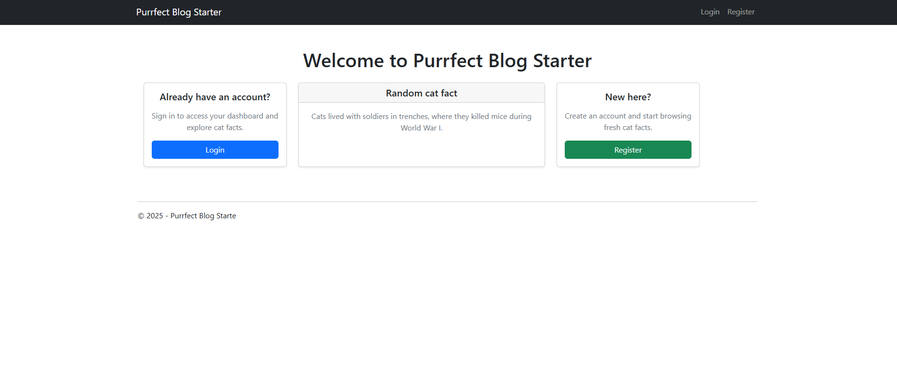
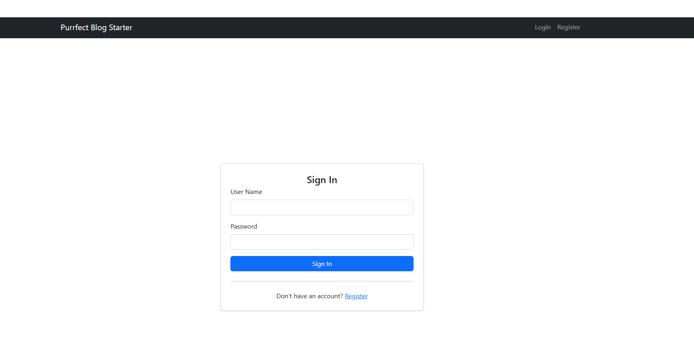
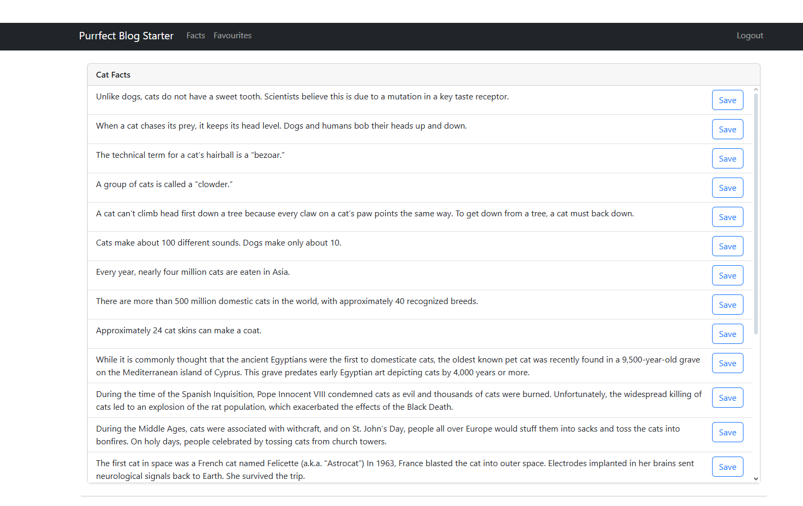

# 🐱 Purrfect Blog Demo (.NET Framework 4.7)

A simple **ASP.NET MVC (Framework 4.7)** application hosted on **Azure App Service**.  
The project demonstrates user seeding, connecting to **Azure SQL Database**, and displaying dynamic content (random cat facts) on the homepage.

## 🌐 Live Demo

👉 **Live:** https://purrfect-blog-demo-bmfqdnd9defkhxh5.westeurope-01.azurewebsites.net

**Demo Credentials:**
- **Username:** Test1 — **Password:** `Test1#123`
- **Username:** Test2 — **Password:** `Test2#123`
- **Username:** Test3 — **Password:** `Test3#123`

The homepage is public and displays a random cat fact to all visitors.

---

## 📖 About

This project was built as a demo/training app to showcase:
- Deploying an **ASP.NET MVC 4.7** app to Azure App Service.
- Using **Entity Framework** with Azure SQL Database (with seeded demo users).
- Displaying dynamic content (cat facts) on the home page.
- Providing a basic login system with pre-created accounts.

### ✨ Features

1. **Random Cat Facts** – homepage shows a random fact on each refresh.  
2. **Seeded Users** – three demo accounts available for login.  
3. **Azure SQL Integration** – data is stored and managed in an Azure SQL Database.  
4. **Azure Hosting** – live demo hosted on Azure App Service with HTTPS.  

---

## 🧱 Tech Stack

- **.NET Framework 4.7**, **ASP.NET MVC**
- **Entity Framework**
- **Azure App Service** (Windows/IIS)
- **Azure SQL Database**

---

## 🖼️ Screenshots

### Home Page (Random Cat Fact)

### Login Page

### Dashboard

---

## 🚀 Running Locally

### Requirements
- **Visual Studio 2019/2022** with *ASP.NET and web development* workload  
- **.NET Framework 4.7** installed  
- Local SQL database (optional) or Azure SQL connection string

### Steps
1. Clone the repository.  
2. Open the solution in **Visual Studio**.  
3. Build the solution (Release or Debug).  
4. Update the connection string in `web.config`.  
5. Run the app (IIS Express or local IIS).  

On startup, Entity Framework will run migrations and seed demo users.
